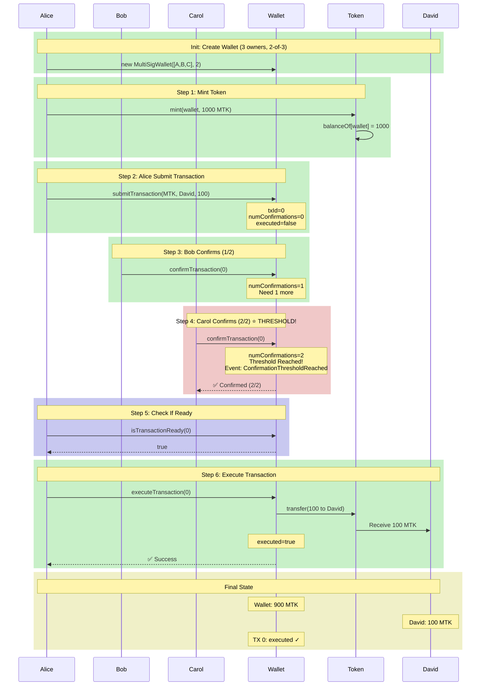

# Foundry Web3 Development Environment

这是一个完整的 Foundry Web3 开发环境，用于智能合约的开发、测试和部署。

## 🎮 交互式模拟器

**[点击这里打开多签钱包模拟器 →](./docs/MultiSigWallet_Simulator.html)**

在浏览器中实时体验多签钱包的完整流程：
- ✅ 模拟交易提交
- ✅ 多人签名确认
- ✅ 阈值达成事件通知
- ✅ 交易执行
- 📝 实时事件日志

## 目录结构

```
foundry-web3-study/
├── src/                 # 智能合约源代码
├── test/                # 测试文件
├── script/              # 部署脚本
├── lib/                 # 依赖库
├── foundry.toml         # Foundry 配置文件
├── package.json         # Node.js 项目配置
└── README.md           # 项目文档
```

## 快速开始

### 1. 安装 Foundry

如果还没有安装 Foundry，请运行：

```bash
curl -L https://foundry.paradigm.xyz | bash
foundryup
```

### 2. 安装依赖

```bash
forge install
```

### 3. 编译合约

```bash
forge build
```

### 4. 运行测试

```bash
# 运行所有测试
forge test

# 运行特定测试文件
forge test --match-path test/Counter.t.sol

# 显示气体报告
forge test --gas-report

# Fuzz 测试（模糊测试）
forge test --match-test testFuzz
```

### 5. 本地开发（可选）

启动本地 Anvil 节点：

```bash
anvil
```

在另一个终端部署合约：

```bash
forge script script/Deploy.s.sol:Deploy --rpc-url localhost --broadcast
```

### 6. 部署到测试网

设置环境变量（Sepolia 示例）：

```bash
export ALCHEMY_API_KEY="your_alchemy_api_key"
export PRIVATE_KEY="your_private_key"
```

部署合约：

```bash
forge script script/Deploy.s.sol:Deploy --rpc-url sepolia --broadcast --verify
```

## 项目文件说明

### src/Counter.sol
示例智能合约，演示基本的合约编写：
- ✅ 状态变量管理
- ✅ 事件触发
- ✅ 访问控制修饰符示例
- ✅ 函数实现最佳实践

### test/Counter.t.sol
完整的测试套件，包括：
- ✅ 单元测试
- ✅ 异常处理测试
- ✅ Fuzz 测试（模糊测试）

### src/MultiSigWallet.sol
多签钱包智能合约，支持 ETH 和 ERC20：
- ✅ M-of-N 多签架构（可配置阈值）
- ✅ ETH 和 ERC20 代币转账支持
- ✅ 交易提交、确认、撤销、执行完整流程
- ✅ 透明的确认状态查询
- ✅ 阈值达成事件通知机制

### test/MultiSigWallet.t.sol
多签钱包核心功能测试：
- ✅ ETH 转账测试
- ✅ ERC20 转账测试
- ✅ 确认撤销测试
- ✅ 权限控制测试

### test/MultiSigWallet.demo.t.sol
完整的端对端演示测试，展示：
- ✅ 多签钱包的完整工作流程
- ✅ 从铸币到执行的全过程
- ✅ 通知机制的实际应用

### script/Deploy.s.sol
部署脚本示例：
- ✅ 支持本地 Anvil 部署
- ✅ 支持公共测试网部署
- ✅ 支持主网部署（需谨慎）

## 多签钱包流程图

### 交易执行流程

下图展示了多签钱包的完整交易流程（GitHub 原生支持）：



**流程说明：**
1. **初始化** - 创建 3 个所有者的钱包，设置 2/3 的签名阈值
2. **铸币** - 为钱包铸造 1000 MTK 代币
3. **提交交易** - Alice 提交转账 100 MTK 给 David 的交易（txId=0）
4. **Bob 确认** - 第一个确认者签名（1/2）
5. **Carol 确认** - 第二个确认者签名，达到阈值（2/2） ⭐ **触发通知事件**
6. **检查就绪状态** - `isTransactionReady()` 返回 `true`，交易已准备好执行
7. **执行交易** - Alice 执行交易，完成转账给 David
8. **最终状态** - 交易已执行，余额更新完成（Wallet: 900 MTK, David: 100 MTK）

## 常用命令

```bash
# 编译
forge build

# 测试
forge test
forge test -v                    # 详细输出
forge test --gas-report         # 显示气体使用情况

# 部署
forge create src/Counter.sol:Counter --rpc-url <RPC_URL> --private-key <PRIVATE_KEY>

# 格式化代码
forge fmt

# 查看合约 ABI
forge inspect Counter abi

# 本地开发
anvil                            # 启动本地节点
cast send <ADDRESS> <FUNCTION>   # 调用函数
cast call <ADDRESS> <FUNCTION>   # 读取状态
```

## Foundry 特性

- 🔥 **Solidity 原生开发** - 用 Solidity 编写测试
- ⚡ **快速编译** - 极快的编译速度
- 🧪 **强大的测试框架** - 支持单元测试、集成测试、Fuzz 测试
- 📊 **气体分析** - 详细的气体使用报告
- 🚀 **脚本和模拟** - 灵活的部署和交互脚本
- 📝 **Cheatcodes** - 强大的测试 cheatcodes

## 有用的资源

- [Foundry 官方文档](https://book.getfoundry.sh/)
- [Forge-std 库](https://github.com/foundry-rs/forge-std)
- [OpenZeppelin Contracts](https://github.com/OpenZeppelin/openzeppelin-contracts)
- [Solidity 文档](https://docs.soliditylang.org/)

## 注意事项

⚠️ **安全提示**：
- 永远不要在版本控制中提交私钥
- 在主网部署前充分测试
- 使用 `.env` 文件管理敏感信息
- 部署前进行代码审计

## 许可证

MIT
